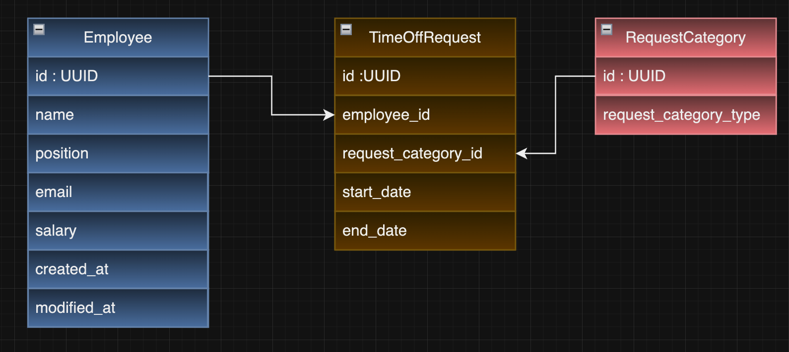

# Getting Started

## Project Information

This project created for Circle by Osman Özden.

### Tech Stack

- JavaSE 17
- PostgresSQL Latest Version
- Maven 3.8.1
- Spring Boot 3.3.3
- Hibernate


### Reference Documentation
For further reference, please consider the following sections:

* [Official Apache Maven documentation](https://maven.apache.org/guides/index.html)
* [Spring Boot Maven Plugin Reference Guide](https://docs.spring.io/spring-boot/3.3.3/maven-plugin)
* [Create an OCI image](https://docs.spring.io/spring-boot/3.3.3/maven-plugin/build-image.html)
* [Spring Boot DevTools](https://docs.spring.io/spring-boot/docs/3.3.3/reference/htmlsingle/index.html#using.devtools)
* [Spring Web](https://docs.spring.io/spring-boot/docs/3.3.3/reference/htmlsingle/index.html#web)
* [Spring Data JPA](https://docs.spring.io/spring-boot/docs/3.3.3/reference/htmlsingle/index.html#data.sql.jpa-and-spring-data)

### Guides
The following guides illustrate how to use some features concretely:

* [Building a RESTful Web Service](https://spring.io/guides/gs/rest-service/)
* [Serving Web Content with Spring MVC](https://spring.io/guides/gs/serving-web-content/)
* [Building REST services with Spring](https://spring.io/guides/tutorials/rest/)
* [Accessing Data with JPA](https://spring.io/guides/gs/accessing-data-jpa/)


### Environment setup
Make sure following software is installed on your PC.
* [OpenJDK 17](https://adoptium.net/releases.html?variant=openjdk17&jvmVariant=hotspot) or later.
* [Maven 3.8.1](https://maven.apache.org/install.html) or later
* [docker.io 20.x](https://www.docker.com/) or later

### Database Setup
- [Docker Setup](https://docs.docker.com/get-docker/)
    and run  
```
docker-compose up
```


### Compile & Build
Most examples are build by top-level maven project.
```
mvn clean

mvn build
```

### Entity Topology 




### Bootstrap Data
When the project starts, it automatically creates 3 different Request Categories and 1 Employee in the database.
You can review the relevant code for more detailed information! 
```
src/main/java/com/circle/util/StartupRunner.java
```
### Swagger Doc
```
http://localhost:8080/swagger-ui.html
```

# Endpoints


## Employee Module

### Create Employee
```
curl -X POST 'http://localhost:8080/employee/createEmployee' \
--header 'Content-Type: application/json' \
--data-raw '{
"name": "OSMAN",
"position": "Senior Backend Developer",
"email": "ozden.osman@hotmail.com",
"salary": 500
}'
```

### Update Employee
```
curl -X PUT 'http://localhost:8080/employee/updateEmployee?id=55446f38-6e11-4e45-961e-5394945272f1'
' \
--header 'Content-Type: application/json' \
--data-raw '{
"name": "muhammed",
"position": "Senior Java Developer",
"email": "ozden@gmail.com",
"salary": 500
}'
```
### Get Employee
```
curl -X GET 'http://localhost:8080/employee/getAllEmployee?id=55446f38-6e11-4e45-961e-5394945272f1'
```

### Get All Employees
```
curl --location 'http://localhost:8080/employee/getAllEmployees
```
### Delete Employee
```
curl -X DELETE 'http://localhost:8080/employee/getAllEmployee?id=55446f38-6e11-4e45-961e-5394945272f1'
```
## Request Category Module

### Get All Request Category

```
curl -X GET 'http://localhost:8080/requestCategory/getAllCategory'
```

## TimeOff Module

###  Create TimeOff Request 

```
curl -X POST 'http://localhost:8080/timeoff/createTimeOffRequest' \
--header 'Content-Type: application/json' \
--data '{
    "employeeId": "56edbd0c-655b-4ece-9399-086167ec4001",
    "requestCategoryId": "2d2b7d32-00b4-4acb-a214-d181da071ecb",
    "startDate": "2024/01/01",
    "endDate": "2024/02/01"
}'

```

### Get TimeOff Request
```
curl -X GET "http://localhost:8080/getTimeOffRequest?id=your-uuid-here" \
-H "Accept: application/json"
```


# Author Information

This project created for Circle by Osman Özden.

For Contact:
- ozden.osman@hotmail.com
- +90 536 620 17 46
- [LinkedIn](https://www.linkedin.com/in/osmanozden/)
- [Github](https://github.com/osmanozden)
